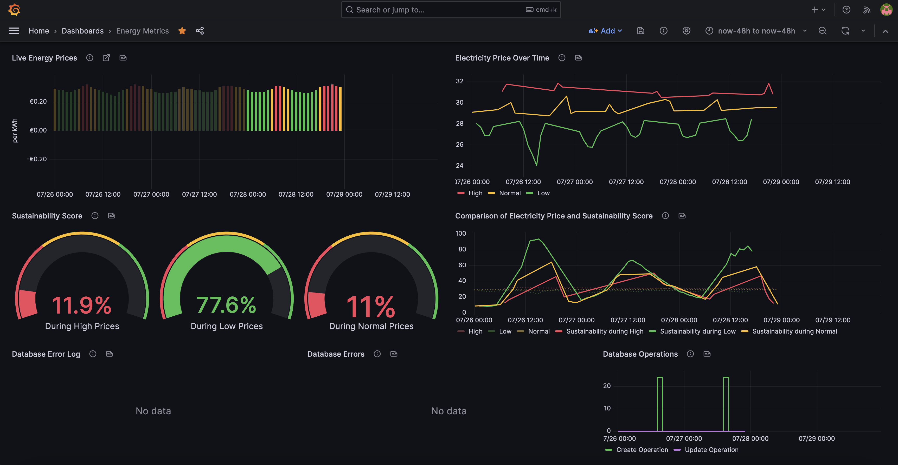

# Zonneplan Energy Data Inserter

The [Zonneplan](https://www.zonneplan.nl/) Energy Data Inserter is a Node.js application designed to regularly insert energy data into an InfluxDB database. This data is fetched from the energy provider Zonneplan, and includes information such as the hourly energy price and sustainability scores.

The application is designed to run on GitHub Actions, and is scheduled via the `main.yaml` workflow. The workflow can also be manually triggered if needed.

## Getting Started

The `main.yaml` workflow file in the GitHub Actions defines how and when the job is run. It can be adjusted to run on a schedule that suits your needs, or triggered manually. 

To manually trigger the workflow, follow the steps in the Actions tab of the GitHub repository and choose `main.yaml`.

#### 1. Installing Modules
To install all necessary Node Modules please run the following command:

```bash
npm install
```

#### 2. Run
To execute the Zonneplan Energy Data Inserter please run:

```bash
npm run start
```

> **Note**: You may want to setup a Cron job to schedule the repeated execution of this command. Also, the Application is developed for and checked to be compatible with Node.js 18. You may use a later version at your own risk.

## Configuration

The application requires several environment variables to function correctly, including details for the Zonneplan API and the InfluxDB. Sensitive environment variables are recommended to be set in the GitHub Secrets.

Here is a list of the required environment variables:

- `ZONNEPLAN_REFRESH_TOKEN` OAuth Refresh Token (Connect to a GitHub Secret with the same name)
- `ZONNEPLAN_ACCESS_TOKEN` OAuth Access Token (Connect to a GitHub Secret with the same name)
- `ZONNEPLAN_EXPIRY_DATE` OAuth Access Token Expiry Date ISO 8601 formatted (Connect to a GitHub Secret with the same name)
- `ZONNEPLAN_CONFIRM_LINK` Optionally, validate a Zonneplan Login Confirmation Link. Ideally via Manual Workflow execution.
- `ZONNEPLAN_TOKEN_TYPE` Stores Zonneplan OAuth Access Token Type (Connect to a GitHub Secret with the same name)
- `ZONNEPLAN_EMAIL` Your E-Mail to login to Zonneplan. Please use a throw-away account, not your actual account (Only accesses semi-public data).
- `GITHUB_TOKEN` A GitHub Token with Write Access to your Repository Secrets.
- `GITHUB_REPOSITORY` The Name of your Repository (e.g. 'superclustr/zonneplan-scraper')
- `INFLUXDB_TOKEN` An InfluxDB Token you created to Access the Database.
- `INFLUXDB_URL` The Host of your Influx Database (e.g. 'https://us-east-1-1.aws.cloud2.influxdata.com')
- `INFLUXDB_ORG` The Organization of your Influx Database (e.g. 'acme')
- `INFLUXDB_BUCKET` The Bucket name you want to feed data into (e.g. 'zonneplan'). Beware this pre-defines the Monitoring Bucket name ending with '_monitoring'!

For detailed instructions on how to configure these, please refer to the [GitHub Secrets documentation](https://docs.github.com/en/actions/security-guides/encrypted-secrets).

## Code Overview

The application uses the `@influxdata/influxdb-client` package to write data to InfluxDB, and several custom modules to handle the communication with the Zonneplan API.

In general, the application will do the following:

1. Authenticate with Zonneplan API
2. Connect to the InfluxDB instance
3. Fetch energy data from the Zonneplan API
4. Write the fetched data to InfluxDB
5. Log how many data points were created and updated

The code also handles exceptions and will write any fatal errors to the InfluxDB.

## Database Documentation

Please refer to the [Zonneplan InfluxDB Documentation](./docs/database_documentation.md) for more details about the database structure and how to extract data from it.

## Contributing

Contributions are welcome! Please create an issue if you have any suggestions, questions or bug reports. If you wish to contribute to the code, feel free to create a pull request. Be sure to update the `main.yaml` workflow file if needed to reflect your changes.

## Resources

## Resources

To help you kickstart your journey with Energy Metrics, we've created an example Grafana Dashboard that you can readily use.



Before you proceed, please ensure that your Grafana and InfluxDB instances are correctly set up and that Grafana has successful connectivity to your InfluxDB database. Follow these steps to set up the example dashboard:

1. Download the [`grafana-dashboard-example.json`](./grafana-dashboard-example.json) file. This file contains the dashboard configuration.
2. Open your Grafana instance in your web browser.
3. Click on the `+` button on the left-hand side panel or hover over it and then click on `Import`.
4. In the Import Dashboard dialog, click on `Upload .json file`.
5. Select the `grafana-dashboard-example.json` file that you downloaded earlier.
6. On the next screen, you may need to select the relevant data source you wish to use for the dashboard from the `Options` section. If you have only one data source, it should be selected automatically.
7. Click on `Import`. Your dashboard should now be ready and you can navigate to it by clicking on `Dashboards` > `Manage` on the left-hand side panel.

This dashboard is a great starting point and we encourage you to customize it further according to your specific needs. 

Happy data exploring!

## Contact

For additional data or information, reach out to me at rroeper@superclustr.net.

## Acknowledgements

This project uses the InfluxDB Client for JavaScript provided by InfluxData. Refer to their [official documentation](https://www.influxdata.com/blog/getting-started-with-influxdb-and-nodejs/) for more information on how to use it.
